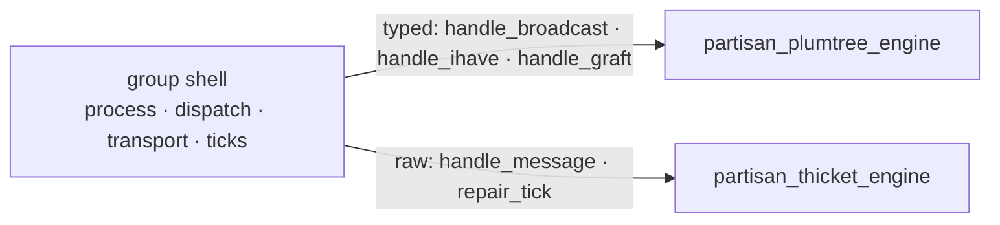

# ADR-000004: Thicket Engine — Faithful Implementation, Seam Revision, and Property-Based Validation

- **Status:** PROPOSED
- **Decision:** When a measured interior-node-load imbalance justifies it (the gate
  from ADR-000002), implement **Thicket** (Ferreira, Leitão & Rodrigues, SRDS 2010)
  faithfully as broadcast engine #2 behind an extended `partisan_broadcast_engine`
  seam. Thicket embeds T interior-node-disjoint spanning trees over the group's
  overlay and bounds each node's interior (forwarding) load by `maxLoad`. The current
  seam is Plumtree-shaped and cannot carry what Thicket needs; this record specifies
  the seam revision and the algorithm. Because no Common Test case exercises an
  off-by-default engine, the primary validator is a PropEr simulation of the pure
  engine.

## Context

ADR-000002 made the tree engine a per-group slot and accepted Thicket as the gated
opt-in engine #2, extracting the `partisan_broadcast_engine` behaviour with Plumtree
as engine #1. Specifying Thicket against that seam showed it is not a drop-in: the
seam and wire format are Plumtree-shaped, and Thicket needs four things they do not
provide. This record grounds the algorithm in the paper (Algorithms 1–4), states the
seam revision, and defines a validation strategy that does not rely on Common Test.

## The decision

### 1. The algorithm

Thicket builds T trees over one overlay — one per broadcast source — keeping each
node interior in *few* trees and a leaf in the rest, so forwarding load is spread and
a single failure disrupts few trees. Each node partitions its neighbours per tree
into `activePeers` (used in that tree) and `backupPeers` (used in none); it is
**interior** in a tree when it has more than one active peer there, and its **load**
is the number of trees it is interior in, capped at `maxLoad`.

Four mechanisms maintain the trees, and every message piggybacks the sender's
per-tree load so peers can steer interior duty toward the least-loaded node:

- **Construction** — a novel message attaches the receiver to the tree (adopt the
  sender, and branch to up to `f−1` backup peers if under the load cap); a duplicate
  prunes the now-redundant link.
- **Repair** — periodic `Summary` advertisements let a node that is missing a message
  graft the best-placed announcer, turning the randomised construction into full
  coverage.
- **Reconfiguration (Balance)** — swap a heavily-loaded parent for a lighter announced
  alternative, gated on the announcement having *preceded* the data (which avoids
  cycles).
- **Overlay dynamics** — neighbour up/down fold into the peer sets; repair recovers
  any tree a failed neighbour was carrying.

The full mechanism, with every guard, lives in `partisan_thicket_engine`.

### 2. The seam revision

The current seam decodes fixed Plumtree tuples and passes typed booleans to the
engine. Thicket needs four additions, all additive to the behaviour:

- **Raw, load-carrying messages** — the shell stops destructuring Plumtree tuples and
  hands the whole inbound message to the engine (`handle_message/2`), which owns its
  own wire shape (DATA/Summary/Graft/Prune, each carrying `Load`).
- **A repair tick** — a periodic `repair_tick/1` (alongside `lazy_tick`) lets the
  engine age announcements and fire repairs; the shell owns the timer.
- **`loadEstimate`** — carried in-band and kept in engine state.
- **Per-tree `activePeers`/`backupPeers` and `maxLoad`/`T`/`f`** — internal to the
  engine.

The shell keeps the process, dispatch and transport; the additions are engine-facing,
so a raw engine drops in behind the same behaviour:

### 3. Invariants

- **Interior-load bound** — no node is interior in more than `maxLoad` trees (may be
  transiently exceeded during reconfiguration, then shed).
- **Coverage** — every node is connected to every tree; repair guarantees this after
  the randomised construction leaves gaps.
- **Reconfiguration termination** — the Summary/Graft/Prune/Balance exchange
  converges; the announcement-precedes-data guard and the load-gated graft prevent
  cycles and oscillation.
- **No regression of the default** — a Plumtree group is byte-for-byte unchanged;
  Thicket runs only where a group's engine is `thicket`.

### 4. Validation

The engine is pure (I/O-free, action-returning), so a deterministic simulation is the
right validator. A PropEr model instantiates N engine states, drives
Broadcast/NeighborUp/NeighborDown, routes each returned `{send, …}` action to its
target, and advances repair ticks — checking coverage, the interior-load bound, and
termination after each step. This is the *only* detector, since `partisan_SUITE`
never enables Thicket; one CT smoke case may additionally confirm end-to-end delivery
on real nodes.

### 5. Configuration and rollout

A group selects Thicket via `broadcast_groups` (`engine => thicket`, with
`max_load`/`t`/`f`), defaulting to Plumtree. Engine choice is a **group-wide
invariant** — all nodes agree, like the group name — because Thicket's wire format and
load semantics differ from Plumtree's and are never mixed within one group. The
paper's parameter guidance (`maxLoad` a generous ceiling, `T ≤ f`, overlay degree
≈ `f·T`) is baked into `new/3` and documented on the engine module. Enabling Thicket
stays gated on the measured imbalance; the control-plane group stays Plumtree.

## Rationale

- **Faithful, not approximate.** A hard `maxLoad` without repair can starve a subtree;
  Thicket's Summary-driven repair is what restores coverage, so it is not optional —
  it is what earns the interior-disjointness guarantee a load heuristic cannot.
- **The seam revision is real.** Thicket's load piggybacking, announcements and repair
  timers are genuinely new surface; naming the four additions turns implementation
  into a mechanical exercise.
- **PropEr is the honest detector.** Common Test cannot exercise an off-by-default
  engine; asserting the invariants on the pure engine in simulation is stronger and
  reproducible, and matches how the protocol was originally evaluated.
- **Gated, not eager.** The record specifies *how*, so the *whether* stays tied to a
  measured need.

## Alternatives considered

- **Soft-cap variant** (prefer-to-shed, always forward). Coverage-safe by construction
  but *not Thicket*: without repair and reconfiguration it does not build
  interior-node-disjoint trees. Recorded as the fallback if the full protocol is later
  judged too costly.
- **Load-biased Plumtree** (bias eager selection by load, no disjointness). Rejected in
  ADR-000002 and reaffirmed: it muddies one engine with two behaviours and has no
  coverage or termination argument.
- **Implement before recording.** Rejected: a correctness-critical protocol with no CT
  detector warrants a written design and a measured trigger first.

## Consequences

- New surface: an extended `partisan_broadcast_engine` (raw `handle_message`,
  `repair_tick`), `partisan_thicket_engine`, per-group `engine`/`max_load`/`t`/`f`
  config, and a PropEr model.
- A Thicket group's messages carry `Load` and differ from Plumtree's — safe, because
  engine choice is group-wide.
- The shell's receive dispatch generalises from destructured tuples to handing the raw
  message to the engine — one dispatch path for both engines.
- The substrate is no longer tied to Plumtree's message shape; a future engine defines
  its own wire messages behind the same seam.

## Related records

- **ADR-000002** — made the tree engine a per-group pluggable slot and accepted
  Thicket as the gated opt-in engine #2; this record is its faithful-implementation
  and seam-revision companion.

## References

- Mário Ferreira, João Leitão, Luís Rodrigues. *Thicket: A Protocol for Building and
  Maintaining Multiple Trees in a P2P Overlay.* SRDS 2010 (Technical Report
  RT/28/2010) — Algorithms 1–4.
- João Leitão, José Pereira, Luís Rodrigues. *Epidemic Broadcast Trees.* SRDS 2007
  (Plumtree — engine #1).
