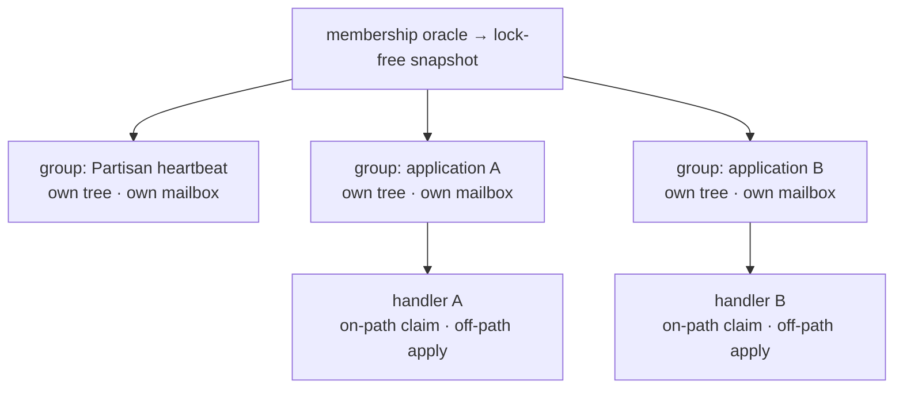

# PDDR-000001: Per-Group Epidemic Broadcast — One Tree per Stream, Handler Work off the Tree Process

- **Status:** ACCEPTED
- **Decision:** Partisan's epidemic-broadcast substrate stops being a single
  shared process. It becomes a supervised set of **broadcast groups**, each
  owning its own process, mailbox, spanning-tree state and outstanding table,
  and each driven by the one **unchanged** membership oracle. The handler
  behaviour is split into a **fast, on-path novelty *claim*** and an **off-path
  *apply*** that runs on the handler's own process under backpressure. The
  **isolation unit is the group, not the channel.**

## Context

Partisan's gossip substrate is `partisan_plumtree_broadcast`: a single
`gen_server`, registered under one name, started once by the top supervisor. It
maintains one spanning tree (the Plumtree eager/lazy push scheme) and dispatches
to a static list of handler modules registered through `broadcast_mods`.

That one process **complects three concerns that should stand apart**:

1. **The overlay oracle** — who is a member and who is connected. This lives in
   the peer-service manager (`partisan_pluggable_peer_service_manager`) and is
   *already* separated: it pushes membership outward through
   `partisan_peer_service_events` with cast semantics, and its reads are
   ETS-backed. The membership CRDT is disseminated by the manager's **own**
   periodic gossip on the membership channel — **not** over the broadcast
   substrate. Nothing about this concern needs to change.

2. **Epidemic tree maintenance** — building and repairing the broadcast tree
   over the overlay (eager/lazy sets, graft, prune, lazy ticks, anti-entropy
   exchanges).

3. **Application handler execution** — the `merge` / `is_stale` / `graft` /
   `exchange` callbacks for every registered module, including Partisan's own
   tree-stimulating heartbeat (`partisan_plumtree_backend`) and every embedding
   application (a metadata store, an application gossip stream, anything else
   that rides the substrate).

Concern 3 runs **inside** concern 2's single process, and concern 2 is a
**global singleton shared across independent message streams**. Two failure
modes follow directly, and both are observed when an application drives its own
high-volume gossip through the shared substrate: **head-of-line blocking** (the
handler's `merge` is invoked synchronously on the one process that serves every
handler) and **shared-tree pollution** (the eager/lazy sets are keyed by
broadcast root only, so each stream's prune/graft feedback reshapes the tree the
others depend on).

Registration compounds the problem: `broadcast_mods` is read once at start-up
and stored; there is no runtime lifecycle for an application to create or retire
its own broadcast stream, and no supervision boundary between an application's
handler and Partisan's control plane.

This record settles the shape of the fix: the isolation unit is the independent
message stream, made concrete as a supervised broadcast group.

## The decision

### 1. The broadcast group is the unit of isolation

A **broadcast group** is a named, supervised process that owns a complete,
private epidemic-broadcast context:

- its **own mailbox** (no cross-stream multiplexing),
- its **own spanning-tree state** (eager/lazy sets, keyed by root within the
  group),
- its **own outstanding-lazy table**,
- a **tree engine** (below), and
- one or more **handlers**, plus the **channel** it transmits on and its tick
  and fanout parameters.

A group is identified by a name of its own, **not** by the channel. The channel
is a transport attribute of a group — which connections carry its messages —
not the group's identity. Partisan's tree-stimulating heartbeat is one group, on
the membership channel. Each embedding application instantiates its own group,
ideally on its own channel. The group definition is:

    group := { handler(s), channel, fanout, tick periods }

### 2. The handler contract splits: on-path claim, off-path apply

The broadcast-handler behaviour separates the cheap decision the *protocol*
needs from the expensive work the *application* wants:

- **On-path — `claim`.** When a broadcast arrives, the group asks the handler
  whether the message is novel. This step is required to be **fast, pure, and
  atomic**: it decides novelty *and* records the message identifier as seen in
  one step (an insert-if-absent against the handler's own table). It runs on the
  group process because the tree's eager-vs-lazy decision depends on its result —
  novel keeps the sender eager, duplicate prunes the sender to lazy, exactly as
  Plumtree prescribes. Partisan's heartbeat handler already realises this shape:
  its staleness check is a direct table read with no round-trip.

- **Off-path — `apply`.** When `claim` reports novelty, the group hands the
  payload to the **handler's own process** for the heavy work (merge, persist,
  CRDT combine). Delivery is asynchronous and **bounded**: the handler applies
  backpressure, and the group never blocks on it. Because `claim` already
  recorded the identifier atomically, a redelivery of the same message is
  recognised as a duplicate *before* `apply` has completed — so moving `apply`
  off-path preserves at-least-once, idempotent delivery and cannot double-apply.

- **`graft`** remains an on-path read (return the stored payload for
  retransmission); it is already a table read in the reference handler.

- **`exchange`** remains the handler's anti-entropy hook and **must** run in the
  background; the group starts and monitors it, and per-group isolation means a
  misbehaving exchange can only stall its own group.

The novelty *claim* generalises today's staleness check; the *apply* is what
today's `merge` does after it. The change is to stop running `apply` on the tree
process and to make the claim the atomic point of record.

### 3. The oracle relationship — read-only, fan-out, never feed back

Every group derives membership from the single oracle by subscribing to
`partisan_peer_service_events`. Membership fan-out to N groups is N cheap casts;
it imposes no back-pressure on the manager, and the manager's own gossip and
process are untouched. A group's membership is **private derived state**; a group
never writes membership back, and `broadcast_members` is answered from the
**oracle** (`partisan_peer_service:members/0`), not from any group's cached copy.
This removes the current conflation of "the oracle's membership" with "a tree's
cached membership," which otherwise has no well-defined answer once there is more
than one tree.

### 4. Tree construction is factored out of the group shell

A group delegates tree construction and repair to a **tree engine**, so the group
shell — its process, mailbox, membership poll and handler dispatch — stays
independent of the eager/lazy push mechanics. The engine owns the tree topology
and its graft/prune/summary transitions; the shell owns everything else, which
keeps the group abstraction, the handler contract and the oracle relationship
independent of how the tree itself is built. Plumtree is the engine.

### 5. Dynamic lifecycle and supervision isolation

Groups are children of a dynamic supervisor with a `start_group` / `stop_group`
surface, so an application creates and retires its own broadcast stream at
runtime rather than through boot-time configuration. Each group (and its
handler's apply process) is supervised independently: an application handler that
crashes restarts within its own subtree and **does not** disturb Partisan's
control-plane group.

## Rationale

- **Simple, not easy.** The singleton is *easy* — one process, one registered
  name — but it braids three concerns. Separating them is more moving parts and a
  genuinely simpler system: each group is one stream's worth of state, reasoned
  about in isolation.

- **The seam is the stream, not the channel.** Sharding on channel leaks: two
  handlers sharing the default channel would still collide on one tree and one
  process. The independent message stream — a handler and the tree it drives — is
  the thing that must not be multiplexed. Channel is how a stream is carried, a
  parameter of the group, not its identity.

- **Distributed correctness is preserved, not perturbed.** The oracle, its
  membership CRDT, and its convergence are unchanged; the substrate merely
  subscribes N times instead of once. Giving each stream its own tree *restores*
  the single-stream assumption Plumtree's repair dynamics were designed for.
  Splitting claim from apply keeps delivery idempotent by making the claim the
  atomic point of record, so at-least-once redelivery under OTP restarts stays
  safe.

- **The blocking fix is independent of the tree protocol.** Moving `apply`
  off-path removes the head-of-line stall regardless of how the tree is built, and
  it does not depend on grouping — which is why it leads the realization.

## Alternatives considered

- **Do nothing; document that handlers must be fast.** Rejected. The contract
  already implies backgrounding, yet the substrate still executes `merge` inline
  and shares one tree; the failure is structural, not a matter of handler
  discipline. A guideline cannot make one process serve independent streams
  without interference.

- **Shard per channel.** Rejected as the identity seam. It is necessary but not
  sufficient: handlers sharing a channel still collide, and a handler may want a
  dedicated channel regardless. Channel remains a *group parameter*; it is not
  the unit.

- **One process per handler, apply still inline.** Rejected as insufficient. It
  isolates mailboxes between groups but still stalls *within* a group whenever a
  handler's apply is slow; the off-path split is the part that removes the stall.

- **Mailbox tuning only (priorities, off-heap queue).** Rejected as
  insufficient. It softens symptoms of a shared mailbox without addressing the
  shared tree or the inline apply.

## Consequences

- **New public surface.** A broadcast-group primitive with a runtime lifecycle
  replaces boot-time `broadcast_mods` as the way applications ride the substrate.
  `broadcast_mods` can remain as the definition of Partisan's own default group.

- **Behaviour contract change.** Handlers express novelty as an atomic on-path
  *claim* and heavy work as an off-path *apply*, rather than a single synchronous
  `merge`. Partisan's own heartbeat handler already fits this shape and becomes
  the reference.

- **`broadcast_members` re-homes to the oracle.** Its answer no longer comes from
  a broadcast process.

- **More processes, and per-group control traffic.** Each group runs its own tree
  maintenance (ticks, exchanges). This is the intended cost of isolation; it is
  bounded by the number of groups, which applications control.

- **What this forecloses.** The substrate is no longer a place where unrelated
  streams share fate. A handler can no longer (accidentally or otherwise) reshape
  another handler's tree or stall another handler's delivery.

## Realization

The change is additive and preserves today's behaviour by default. The handler
contract splits so that novelty is claimed on-path and the apply runs off-path in
the handler's own process, removing head-of-line blocking under a shared tree. Each
broadcast handler runs in its own supervised group — a per-stream context with its
own tree and outstanding-lazy table, driven by the unchanged membership oracle and
with a runtime lifecycle. Partisan's heartbeat is the default group and existing
`broadcast_mods` map onto it, so no embedding application is forced to change. Tree
construction and repair are factored out of the group shell into a tree engine, with
Plumtree as the engine.

## References

- João Leitão, José Pereira, Luís Rodrigues. *Epidemic Broadcast Trees.* SRDS
  2007. (Plumtree — the current engine.)
