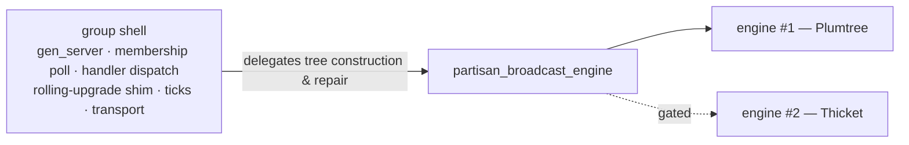

# PDDR-000002: Pluggable Tree Engine and Thicket — Balancing Interior-Node Load Across a Group's Trees

- **Status:** ACCEPTED
- **Decision:** Introduce a pluggable **tree-engine behaviour**
  (`partisan_broadcast_engine`) inside a broadcast group, with today's Plumtree
  as the first engine, and adopt **Thicket** as an opt-in second engine that
  balances **interior-node forwarding load** across the per-root trees a group
  already maintains. The engine is selected **per group by configuration** and
  **defaults to Plumtree**; adopting Thicket for a group is **gated on measured
  interior-node-load imbalance**. A group's engine is a **group-wide invariant**
  (every node must agree, like the group name). The behaviour seam lands exactly
  on the one point where the two protocols differ — the eager-vs-prune decision
  on delivery — so the abstraction is earned, not speculative.

## Context

Within a broadcast group, the group shell owns the process, mailbox and handler
dispatch and delegates tree construction and repair to a pluggable **tree
engine**; Plumtree is the engine today, and Thicket is adopted as an opt-in
second engine.

Plumtree gives each broadcast **root** its own tree (Partisan already keys the
tree state by root). Within one tree the eager-push links form a spanning tree
and the lazy-push links heal it. What Plumtree does **not** do is coordinate
*across* a group's trees: a node that happens to sit on the eager path of many
roots becomes an **interior (forwarding) node** for all of them. Under a handful
of concurrent high-fanout sources this concentrates forwarding work — CPU,
bandwidth, and per-message fan-out — on a few unlucky nodes while others do
almost none. That imbalance, not per-message latency, is the problem Thicket
addresses.

**Thicket** (Ferreira, Leitão, Rodrigues, SRDS 2010) maintains multiple trees
over one overlay such that their **interior nodes are disjoint** as far as a
per-node load cap allows, so forwarding duty is spread across the membership.
Partisan hosts Thicket without disturbing the common case: the engine seam makes
it a local, per-group choice.

## The decision

### 1. A pluggable tree-engine behaviour

The group process (the *shell*) keeps everything that is not tree-shaped:
the `gen_server`, the registered name, the membership poll of the lock-free
snapshot, handler dispatch (`accept_broadcast` / `claim` / off-path
`handle_broadcast`), the rolling-upgrade `route/4` shim, the outstanding table,
the ticks, and the `send` transport. It **delegates tree construction and
repair** to a `partisan_broadcast_engine`:

- seeding peers from membership (`reset_peers` / `neighbors_down`),
- choosing eager vs lazy forwarding targets for a root (`eager_push`,
  lazy-push / `send_lazy`),
- the repair transitions on graft / prune / summary (`handle_ihave`,
  `handle_graft`, `add_eager` / `add_lazy`),
- and anti-entropy (`maybe_exchange`).

Today's Plumtree logic becomes **engine #1**, behaviour-preserving. The
extraction is justified precisely because a second engine now exists — a
behaviour with one implementation would be speculative; this one lands on a real
point of variation (below).

### 2. Where the two engines differ — the point of variation

The seam is well-placed because Plumtree and Thicket diverge at **one decision**:
what a node does when it receives a broadcast.

- **Plumtree:** if the message is novel, keep the sender **eager** (stay in the
  tree, forward onward); if stale, **prune** (become a leaf for that root).
- **Thicket:** the same, **plus** a load rule — a node stays eager/forwarding for
  a root only while it is interior for **fewer than `maxLoad`** roots; at the cap
  it **prunes even a novel message**, shedding interior duty to a peer and
  keeping itself a leaf for the excess root.

So the engine behaviour's delivery callback returns `keep_eager | prune`, and the
whole protocol difference is which rule computes it. Everything else — the
eager/lazy push mechanics, the summary (`i_have`) announcements, graft repair —
is shared. Thicket additionally runs **reconfiguration**: when a node fails or a
tree loses coverage, affected nodes use their lazy/summary links to re-graft a
new forwarder that is under its cap.

### 3. Invariants the design must preserve

- **Interior-load bound.** For every node `n`:
  `|{ root r : n is interior in tree(r) }| ≤ maxLoad`. Best-effort under churn
  (may transiently exceed during reconfiguration), restored by shedding.
- **Coverage.** For every root `r` and node `n`, `n` is reachable in `tree(r)`.
  Reliability is retained by the lazy-push/summary safety net even while trees
  reconfigure — Thicket's delivery guarantee is a superset of Plumtree's.
- **Termination.** Reconfiguration converges: the graft/prune/summary exchange
  must not oscillate. The propagation/summary history that prevents Plumtree's
  re-grafting is the mechanism that keeps this so once load-driven prunes are
  added.
- **No regression of the default.** A Plumtree group behaves exactly as before;
  Thicket is never on a path a Plumtree group takes.

### 4. The scale-gate, made concrete

Thicket costs control traffic (summaries, reconfiguration) and code the common
case does not need. It is therefore **opt-in per group and defaults off**. A
group is a candidate for Thicket only when measurement shows **interior-node
fan-out imbalance** — the distribution of per-node interior load across the
group's trees is skewed (a few nodes forwarding for most roots while others are
idle) under a realistic count of concurrent high-fanout sources. The metric is
that load distribution (e.g. max-to-mean ratio); until a group crosses it,
Plumtree is the right engine. Partisan's own control-plane group is **never** a
Thicket candidate — it is one low-rate source and stays Plumtree.

### 5. Engine choice is a group-wide invariant

A group's engine is selected in its `broadcast_groups` configuration
(`engine => plumtree | thicket`, default `plumtree`). Because the engine
determines wire behaviour (Thicket's load-driven prunes and reconfiguration),
**every node must configure the same engine for the same group** — mixed engines
within one group are unsupported, exactly as a group's name and channel are
cluster-wide invariants. Different groups may use different engines freely. The
default group and every Plumtree group are byte-for-byte unchanged.

## Rationale

- **The abstraction is earned.** Extracting the engine behaviour is only
  justified by a second engine, and the seam lands on the single decision where
  Plumtree and Thicket differ (§2). That is the opposite of speculative
  generality: the boundary is drawn where the variation actually is, and the
  shared 90% of the protocol is not duplicated.
- **Thicket is not a rewrite here.** Partisan already keeps a tree per root
  (`eager_sets` keyed by `Root`). Thicket adds a per-node interior-load count
  across roots and a prune-on-overload rule, plus reconfiguration — a delta on
  existing machinery, not a new stack.
- **Default-off respects the gate.** Making Thicket per-group and opt-in keeps
  the common case (and the control plane) on the simpler, proven engine, and
  honours PDDR-000001's "do not adopt until measured" position while still making
  adoption a local, low-friction decision when the numbers justify it.
- **Reliability is preserved by construction.** Thicket keeps Plumtree's
  lazy-push safety net, so its delivery guarantee is a superset; the load
  balancing changes *who forwards*, not *whether messages arrive*.

## Alternatives considered

- **Stay single-engine (status quo).** Rejected as the long-term answer for
  high-fanout groups: it leaves interior-node imbalance unaddressed and offers no
  path to fix it without forking the broadcast module. Retained as the default
  and the right choice for low-rate groups.
- **A load-balancing heuristic bolted onto Plumtree (no disjointness).** For
  example, biasing eager-peer selection by observed load. Rejected as the primary
  design: it muddies one engine with two behaviours (the flag-parameter smell),
  lacks Thicket's disjointness guarantee, and has no published correctness
  argument. It may still inform Thicket's `maxLoad` default.
- **Adopt Thicket globally / as the only engine.** Rejected: it imposes Thicket's
  control-traffic and complexity on every group including the control plane, and
  discards the working Plumtree path. Per-group opt-in dominates.
- **Implement Thicket without a written design record.** Rejected per the
  project's design-first convention: a protocol with disjointness and termination
  invariants warrants a recorded decision before code.

## Consequences

- **New public surface (on implementation):** a `partisan_broadcast_engine`
  behaviour, a `partisan_thicket_engine`, and an `engine` key in a group's
  configuration. `partisan_plumtree_broadcast`'s tree logic moves behind the
  behaviour as `partisan_plumtree_engine`; the group shell is unchanged in shape.
- **Per-group operational choice.** Operators gain a lever (engine per group) and
  a matching obligation (keep it cluster-consistent per group). Documentation must
  state the group-wide invariant and the measurement that motivates switching.
- **More control traffic where enabled.** Thicket groups carry summaries and
  reconfiguration messages; this is the cost of balanced forwarding and is bounded
  by the group, not global.
- **What this forecloses.** The broadcast substrate is no longer wedded to a
  single tree protocol; a future third engine is a local addition behind the same
  seam, with no change to the group shell.

## Realization

The engine behaviour is extracted and the current Plumtree logic moved behind it as
the default engine — a behaviour-preserving change validated against the existing
broadcast tests, with no group running anything but Plumtree. An alternate engine
(Thicket) sits behind the same behaviour, selectable per group and defaulting off,
with property-based tests for the interior-load bound, coverage, and reconfiguration
termination. Enabling Thicket for any group remains gated on the measured imbalance
above; the control-plane group stays Plumtree.

## Related records

- **PDDR-000001** — established the per-group broadcast architecture and factored
  tree construction into a per-group tree engine; the pluggable engine behaviour
  and the second engine (Thicket) build on that seam.

## References

- Mário Ferreira, João Leitão, Luís Rodrigues. *Thicket: A Protocol for Building
  and Maintaining Multiple Trees in a P2P Overlay.* SRDS 2010.
- João Leitão, José Pereira, Luís Rodrigues. *Epidemic Broadcast Trees.* SRDS
  2007. (Plumtree — the default engine.)
