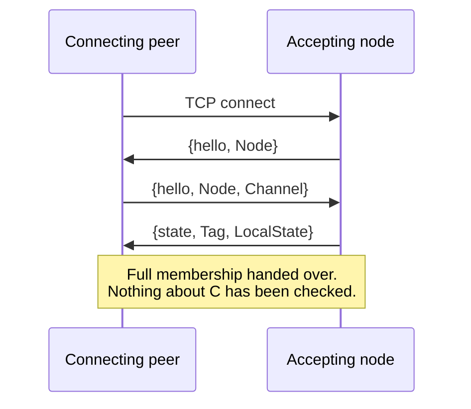
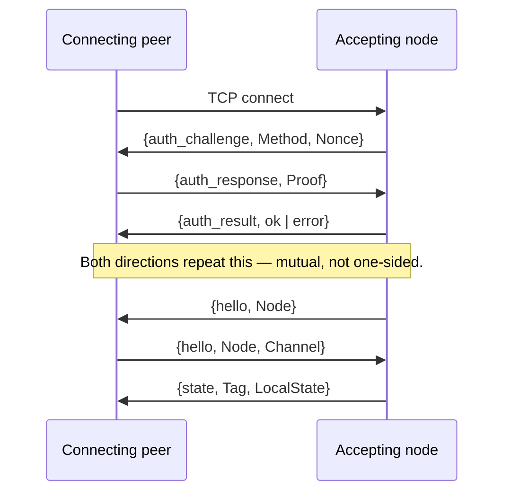

# PDDR-000005: Peer Authentication — A Pluggable, Negotiated Challenge/Response Handshake

- **Status:** PROPOSED
- **Decision:** Insert an authentication phase into the peer handshake, ahead of
  today's `hello`/`state` exchange, so that no membership or application data
  reaches a peer that has not proven its identity. The check is delegated to a
  pluggable `partisan_peer_authentication` behaviour with three verifiers —
  **cryptosign** (per-node Ed25519 keypairs), **gossip keyring** (a rotation-capable
  shared-key ring), and **HMAC-secret** (a single static shared value) — and each
  node negotiates the strongest method both sides accept from a configured,
  ordered method list. An empty list on either side reproduces today's behaviour
  exactly, so the feature is additive and rolling-upgrade safe by construction.

## Context

The peer handshake has no identity check today. On accept, the server sends
`{hello, Node}` and, on receiving the client's reply, immediately builds the
local peer-service state and sends it back — full cluster membership — before
anything about the connecting peer has been verified:

`Tag` is a topology-role label, not a secret, and there is no cookie or HMAC
anywhere in this exchange — Partisan does not use Erlang distribution's cookie by
default (`connect_disterl = false`), so that mechanism is not in play either. The
peer plane's entire security posture today rests on **network isolation**
(documented in `cluster_security.md`) plus **optional TLS**, which authenticates
the *channel* but not the *peer's identity* unless an operator has fully configured
`verify_peer` with a private CA on both sides — a step nothing enforces or checks.
This gap predates the current major version; it is not a regression, and closing
the cheap, non-breaking half of it (bounding frame size, bounding TLS handshake
time, warning loudly at startup) was handled separately. What remains is
structural: an unauthenticated TCP connection can still reach the membership
merge and the peer-message decoder.

Closing that requires changing the handshake contract itself, which is why it is
treated as its own design record rather than folded into the non-breaking pass.

## The decision

### 1. An authentication phase ahead of `hello`/`state`

A new leading exchange runs before the existing handshake on both the accepting
and the connecting side. Only once it succeeds does either side proceed to
`hello`/`state` as today; on failure, the connection is closed and no membership
or user data is ever sent.

Authentication is **mutual**: each side challenges the other, since either role
can be the one an operator wants to keep an impostor from impersonating.

### 2. A pluggable behaviour, not a hardcoded check

`partisan_peer_authentication` is a small, I/O-free behaviour — `init/1`,
`challenge/1`, `respond/2`, `verify/3` — in the same spirit as
`partisan_broadcast_engine` (PDDR-000002): the callbacks compute, they do not
send. A negotiator module drives the exchange from both `partisan_peer_service_server`
and `partisan_peer_service_client`, so the protocol logic exists once, not twice.

### 3. Three verifiers behind the same seam

| Method | Primitive | Identity granularity | Rotation |
|---|---|---|---|
| `cryptosign` | Ed25519 sign/verify | per-node (the public key *is* the identity) | replace one node's key; no cluster-wide step |
| `gossip_keyring` | HMAC-SHA256 over an ordered list of active keys | cluster-wide (proves membership, not which node) | add a key, wait out an overlap window, retire the old one |
| `hmac_secret` | HMAC-SHA256 over one static value | cluster-wide | none — changing it is a coordinated, cluster-wide config change |

`hmac_secret` is implemented as a keyring of size one, not a second MAC
implementation: the two symmetric methods share one verifier module, and only
the *method name* (and therefore what a deployment tells its neighbours it will
accept) differs. `cryptosign` is a separate, asymmetric verifier.

### 4. Negotiation, not a single fixed method

Each node configures an ordered list of acceptable methods,
`peer_auth_methods :: [cryptosign | gossip_keyring | hmac_secret]`, strongest
preference first — the same shape as WAMP's `authmethod` negotiation. The
responder offers its list; the initiator picks the first mutually acceptable
entry. **An empty list (the default) reproduces today's behaviour exactly** —
no challenge phase runs, `hello` is sent immediately as it is now. This is what
makes the feature additive rather than breaking: a v6.0 node, or any node that
has not opted in, negotiates to no-auth with no configuration change required.

Negotiation is also what makes a **live method migration** possible without a
cluster flag day: add a stronger method to every node's accepted list, confirm
it is in use, then narrow the list to require it — the same shape a rolling
key rotation already needs for the keyring method.

### 5. Trust material stays in configuration, not in `node_spec`

`node_spec()` is `#{name := node(), listen_addrs := [...], channels := #{...}}`
— wire state that travels through the membership OR-set's blind gossip merge.
Key material is deliberately **not** added to it: doing so would make trust
anchors travel through the exact merge path a companion hardening item exists to
constrain, and would be a wire-format change with its own rolling-upgrade cost.
Instead each verifier owns its own configuration:

- `peer_auth_cryptosign` — this node's keypair plus a `name() => public_key()`
  map of trusted peers.
- `peer_auth_keyring` — an ordered list of active shared keys.
- `peer_auth_secret` — one static value.

### 6. Where this lands in the existing modules

Traced against the current handshake code:

- `partisan_peer_service_server:acceptor_continue/3` sends `{hello, partisan:node()}`
  the instant a socket is accepted, with no gate. The new challenge is sent from
  here instead, when `peer_auth_methods` is non-empty.
- `partisan_peer_service_server:handle_inbound({hello, Node, Channel}, State0)`
  is where local state is built and `{state, Tag, LocalState}` is sent — the
  exact point membership is handed over today. This clause becomes reachable
  only after the new phase reports success.
- `partisan_peer_service_client:handle_inbound({hello, Node}, State)` is the
  mirror image on the connecting side, gated the same way.
- Both modules' `#state{}` records gain the small amount of state needed to
  track a pending challenge between accept/connect and the existing
  `hello`/`state` pair.

## Rationale

- **The abstraction is earned.** As with the broadcast engine seam
  (PDDR-000002), a behaviour is justified here because three real
  implementations exist, and it lands exactly on the one thing that varies —
  how a proof is computed and checked — while the surrounding exchange
  (challenge, response, result) is identical for all three.
- **Negotiation removes the single biggest deployment obstacle.** A hardcoded
  single method forces every operator into the same key-management story and
  every migration into an atomic cluster-wide cutover. A negotiated, ordered
  list lets a deployment start with the cheapest option (`hmac_secret`, zero
  key-management ceremony) and move to per-node identity (`cryptosign`) later,
  gradually, the same way this codebase has already had to solve rolling
  upgrades for a monitor-protocol change and will need to again for this one.
- **Authenticating before the merge simplifies everything downstream.** Once a
  peer cannot reach the membership merge or the message decoder without passing
  this phase, validating what an *already-authenticated* peer sends becomes a
  narrower, independent problem — the residual risk of an unauthenticated
  decode drops sharply once decode only ever happens post-auth.
- **Keeping trust material out of `node_spec` decouples two independently
  useful fixes.** Whatever validation a connected peer's gossiped `node_spec`
  entries receive does not need to reason about key material, and this record
  does not need to reason about OR-set merge semantics.

## Alternatives considered

- **A single, fixed method.** Rejected: forces one key-management model on every
  deployment and an atomic cluster-wide cutover to change it. The whole value of
  negotiation — incremental adoption, live migration — is lost.
- **Rely on TLS `verify_peer` plus a certificate-subject allowlist, with no
  application-layer method.** Rejected as the *only* mechanism: it makes
  authentication conditional on TLS being fully configured, whereas an
  app-layer challenge/response works whether or not TLS is enabled — matching
  how this gap was originally scoped as something that must hold even without
  TLS.
- **Embed trust material (public keys, secrets) in `node_spec`.** Rejected: it
  is wire state merged by the membership OR-set, so trust anchors would inherit
  that merge's blind-acceptance behaviour and the change would carry its own
  wire-format compatibility cost, entangling this record with membership-merge
  validation instead of composing with it.
- **A separate MAC implementation for `hmac_secret` and `gossip_keyring`.**
  Rejected: `hmac_secret` is exactly a keyring with one non-rotating entry: one
  verifier module, two method names, no duplicated comparison logic.

## Consequences

- **New public surface:** the `partisan_peer_authentication` behaviour, three
  verifier modules, a negotiator, new `peer_auth_*` configuration keys, and one
  new pre-handshake message pair (`auth_challenge` / `auth_response`).
- **Additive by default.** With `peer_auth_methods` unset (the default) on
  either side, negotiation yields no-auth and the wire exchange is byte-for-byte
  what it is today — a v6.0 node and a node that has not opted in interoperate
  exactly as now.
- **Requiring auth on a live cluster is still a two-step rollout**, structurally
  identical to a keyring rotation: widen accepted methods first, confirm
  adoption, then narrow the accepted list to exclude no-auth. This record does
  not remove that operational step, it makes it the *only* step, rather than a
  cluster-wide atomic change.
- **Downstream hardening simplifies.** Membership-merge validation and inbound
  decode hardening both become narrower problems once neither is reachable
  without passing this phase first.
- **Operational surface grows to three methods to document and reason about**,
  offset by the shared verifier for the two symmetric ones and by the default
  being off.

## Realization

Not yet realized — this record is design-first, per this codebase's convention
for a change to the handshake contract. Implementation is expected in phases:
the behaviour and its three verifiers as pure, independently testable modules;
the negotiator and the two call sites in `partisan_peer_service_server` and
`partisan_peer_service_client`; the configuration surface; and a regression
guard extending the membership and broadcast PropEr suites to run under each
authenticated configuration, since those — not Common Test — are what would
catch a handshake regression.

## Related records

- **PDDR-000002** — established the pluggable-behaviour pattern this record
  follows: extract a seam only where real implementations already justify it,
  keep pure callbacks separate from the process that owns I/O.

## References

- WAMP Cryptosign authentication method — challenge/response peer
  authentication using Ed25519 signatures, the basis for the `cryptosign`
  verifier here.
- HashiCorp Serf/memberlist gossip encryption keyring — the rotation model
  (ordered list of active keys, primary plus retiring secondaries) the
  `gossip_keyring` verifier follows.
